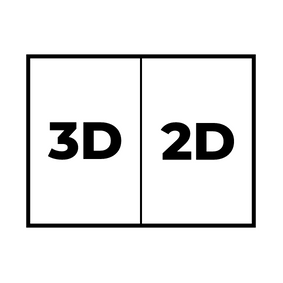
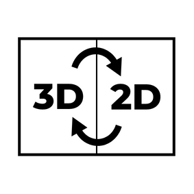
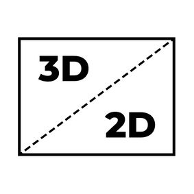

# Viewer Basics

## 1. View Modes
The viewer can be used in three different modes:

#### Navigation Mode:

  
  
In "Navigation Mode", the 3D and 2D viewers can be controlled independently of each other. With the 3D viewer, the 3D model can be posed in any way, while the 2D viewer displays the image that comes closest to the current 3D view.
The fewer images taken during a photogrammetric scan, the greater the differences between the views in the 2D and 3D viewers can be.
All the usual user interactions such as zooming or panning are possible in both the 3D viewer and the 2D viewer. However, these are not transferred to the other viewer.

#### Sync Mode:

  
  
In "Sync Mode" there is a dependency between the 3D and 2D viewer. With the 3D viewer, the 3D model can only be brought into the poses for which an exact 2D view also exists. 
If the 3D model is moved to any position and the userinteraction is finished, the model automatically jumps to the next possible position. A shift is only possible in the 2D viewer. This is applied directly to the 3D viewer. Zooming is possible in both viewers and is also transferred to the other viewer. Thus the 3D and 2D viewers always show the same section of the same object view.

#### One View Mode:

  
  
In "One View Mode, there is the same dependency between 3D and 2D viewers as in Sync mode. However, only one viewer is visible at a time. With a double click it is possible to switch back and forth between the two viewers. In case the viewer is mainly used for viewing the different scan images, it is possible to switch to an image of another pose with only one double-click. Starting from the 2D viewer, the second click must be held down when double-clicking so that the 3D viewer appears. In the pressed state, the 3D model can now be brought into the desired view. When you release the click, the 2D image for the view appears directly.

## 2. Viewer-Layout

## 3. Menu
The menu on the Viewer page contains the following tools and settings:

#### 3D Environment Settings:

  
  

#### Rotation Settings:

  
  

#### Measurement Tool:

  
  

