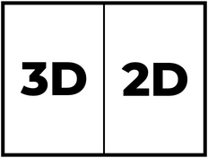
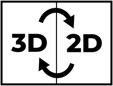
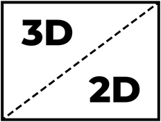
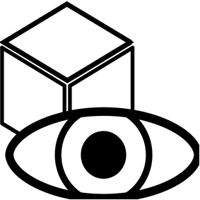
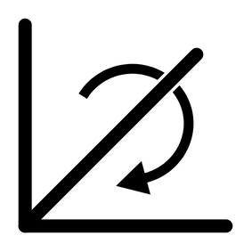
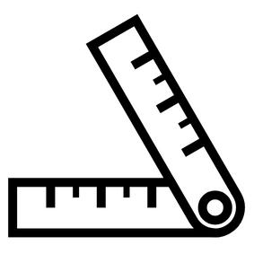

# Viewer Basics
The viewer displays both the 3D model created after a photogrammetric reconstruction and the images used for the calculation. The 3D and 2D viewers are linked as explained in the View Mode section. The 3D viewer is based on model-viewer (https://modelviewer.dev/) and allows interaction (rotate, zoom, translate) with the 3D model in orbit navigation mode. The 2D viewer is based on OpenSeadragon (https://openseadragon.github.io/) and allows the classic interaction of a 2D-viewer (zoom, pan).

## 1. View Modes
The viewer can be used in three different modes:

#### Navigation Mode:

In "Navigation Mode", the 3D and 2D viewers can be controlled independently of each other. With the 3D viewer, the 3D model can be posed in any way, while the 2D viewer displays the image that comes closest to the current 3D view. The fewer images taken during a photogrammetric scan, the greater the differences between the views in the 2D and 3D viewers can be. All the usual user interactions such as zooming or panning are possible in both the 3D viewer and the 2D viewer. However, these are not transferred to the other viewer.
 

#### Sync Mode:

In "Sync Mode" there is a dependency between the 3D and 2D viewer. With the 3D viewer, the 3D model can only be brought into the poses for which an exact 2D view also exists. 
If the 3D model is moved to any position and the userinteraction is finished, the model automatically jumps to the next possible position. A shift is only possible in the 2D viewer. This is applied directly to the 3D viewer. Zooming is possible in both viewers and is also transferred to the other viewer. Thus the 3D and 2D viewers always show the same section of the same object view.
 

#### One View Mode:

In "One View Mode, there is the same dependency between 3D and 2D viewers as in Sync mode. However, only one viewer is visible at a time. With a double click it is possible to switch back and forth between the two viewers. In case the viewer is mainly used for viewing the different scan images, it is possible to switch to an image of another pose with only one double-click. Starting from the 2D viewer, the second click must be held down when double-clicking so that the 3D viewer appears. In the pressed state, the 3D model can now be brought into the desired view. When you release the click, the 2D image for the view appears directly.
 

## 2. Viewer-Layout
The orientation of the 3D and 2D viewers depends on the set viewer size. Each viewer takes up half of the available area. If the format of the 2D viewer does not correspond to the image format, a black border area appears. Whether the two viewers are displayed one below the other or side by side depends on the arrangement in which the black border area is smallest.

## 2. 3D-Viewer Axes

In the menu there is the option to show or hide the coordinate axes. The labels on the axes are designed interactively and can be clicked on. By clicking, the camera view in the 3D viewer is adjusted so that the corresponding axis runs directly towards the screen. If you click on the label "y", the y-axis of the viewer is then aligned and points directly forwards, as can be seen in the illustration on the left. When you click on the label "z", the z-axis is rotated to the front, as shown in the right-hand illustration.
 

## 3. Menu
The menu on the Viewer page contains the following tools and settings:

#### 3D Environment Settings:

The settings for the 3D environment offer the following options:  
- Show and hide coordinate axes (X: red, y: green, z: blue) 
- Change the background via the colour and gradient  
- Changing the brightness of the 3D model via the exposure time 
 

#### Rotation Settings:

The orientation of the 3D model in the 3D viewer can be changed via the Rotation Settings. This has an effect on navigation, but also on the view of the 2D image in "Navigation Mode". The view of the 3D viewer can differ from the 2D viewer in the form of a 2D rotation. To avoid this, automatic rotation can be activated in the settings. The image in the 2D viewer is then rotated according to the view in the 3D viewer. Auto rotation is automatically activated in "Sync Mode" and "One View Mode". In Navigation Mode, a user-defined image rotation can be set.
 

#### Measurement Tool:

The measurement tool allows the creation of a measurement path on the 3D model. The "New" button can be used to start a new measurement path or overwrite an old measurement path. New measurement points can then be added in the 3D or 2D viewer with a "single click". This means that the normal interaction with the viewers, such as zooming, moving and changing the view, is still possible, but if you only briefly click on a position on the object, a measuring point is added. All measuring points are displayed in the 3D viewer, the 2D viewer only displays the current or selected measuring point as long as it is in focus. In the 3D Viewer all distances of the measurement path are displayed. In the menu area of the measuring tool, the sum of the individual distances is displayed. The "Stop" button deactivates the measurement mode and no further measurement points can be added via a "Single-Click". The "Continue" button reactivates the measurement mode and new points can be added to the current measurement path.
 

